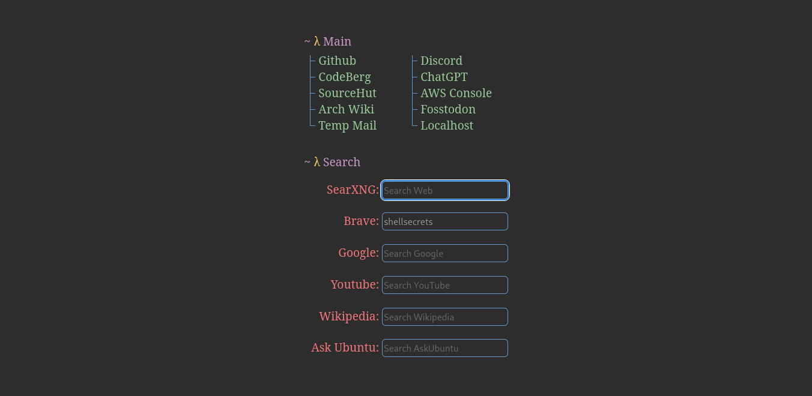

# lhmpage
The best homepage/startpage for a browser in the world.  

startpage is a **custom start page/home page/new tab page** inspired and based on [StartTree](https://github.com/Paul-Houser/StartTree).

Live at <https://search.castorisdead.xyz>.

## Set Up and Configuration
- change your browser's home page, new tab page and startup page to <https://search.castorisdead.xyz>.

- ***For chromium based browsers like chrome and brave:***  
Install an open source extension [NewTab-Redirect](https://github.com/jimschubert/NewTab-Redirect)  and add `https://search.castorisdead.xyz` in it's redirect url field and save it.

- ***For Firefox and firefox based browsers like librewolf:***  
Install an open source extension [newtaboverride](https://github.com/cadeyrn/newtaboverride) and add `https://search.castorisdead.xyz` as custom url in it's settings. Don't forget to enable the option *Set focus to the web page instead of the address bar*.

